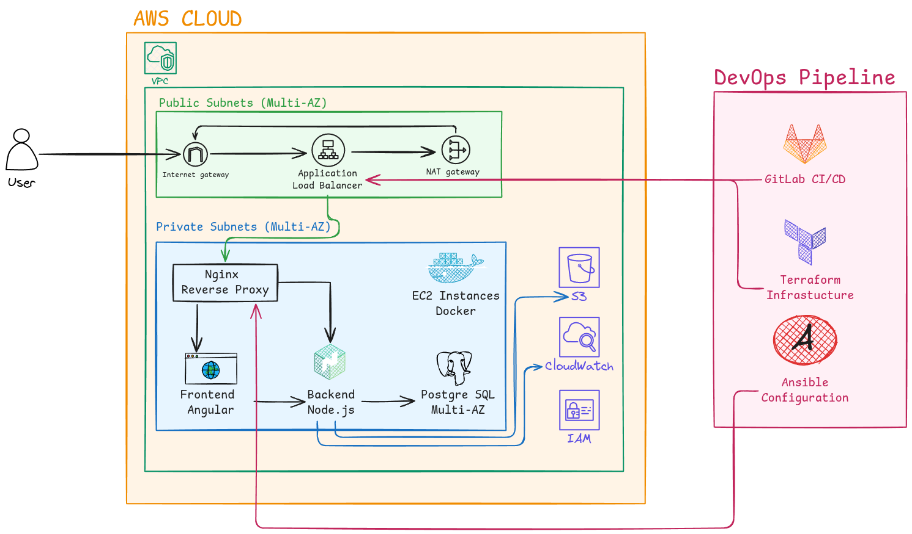

---
## 🏗️ Architecture


## 🛠️ Tech Stack
### Infrastructure & DevOps
- **IaC**: Terraform 1.6+ (AWS Provider 5.x)
- **Configuration Management**: Ansible 2.15+
- **CI/CD**: GitLab CI
- **Cloud Provider**: AWS (Free Tier)
- **Containers**: Docker
- **Monitoring**: AWS CloudWatch

### AWS Services
- **Networking**: VPC, Subnets, Internet Gateway, NAT Gateway, Route Tables
- **Compute**: EC2 (t3.micro), Application Load Balancer
- **Database**: RDS PostgreSQL (db.t3.micro)
- **Storage**: S3 (static assets)
- **Security**: Security Groups, IAM Roles
- **Monitoring**: CloudWatch Logs, CloudWatch Metrics

### Application
- **Backend**: Node.js 18+ / Express.js
- **Frontend**: Angular 17+
- **Database**: PostgreSQL 15
- **Web Server**: Nginx (reverse proxy)

---
## 📦 Prerequisites

### Required Tools
```bash
# AWS CLI
aws --version  # >= 2.13.0

# Terraform
terraform --version  # >= 1.6.0

# Ansible
ansible --version  # >= 2.15.0

# Docker
docker --version  # >= 24.0.0

# Git
git --version  # >= 2.40.0
```
